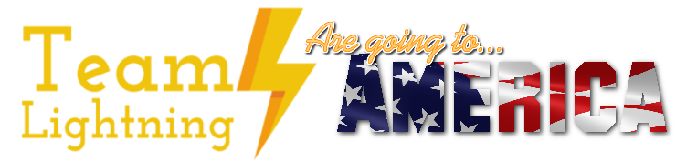

# Team Lightning's Pet Pal

A hub that shows colours depending on the level of the pet's water bowl.

## Backstory

### The beginning

We attended the First Lego League UK and Ireland finals over the half term of Feburary 2017.  We had won the regional South Wales final and were prepared to compete against 47 other teams in order to try and win the opportunity to attend the World Festival in St. Louis, USA.  It was a great day of fun and competition where we participated in three rounds of the robot game. We had several interviews to discuss our robot design, project and core values.  We have put many hours into developing our robot and features which would allow us to complete different objectives on the board and try to get the highest possible score.

​Throughout the day our team work was being assessed and discussed in the core values session as well as the project we had developed which allowed a pet owner to monitor their pet when they weren’t at home.
Our team won the Robot design in the competition, and as the top placed Welsh team, we had been invited to attend The First Lego League World Festival in St. Louis, USA at the end of April.  Exciting times were ahead!

### America

You can watch the video of what we did in St. Louis, America [here.](https://www.youtube.com/watch?v=fzEO07LA4Jw).

## Hub

## Thank you

We'd also like to thank everyone who has helped us made it this far. Our fundraisers were a success and helped us create our project and buy additional parts for the robot. Not only that, but we were glad to represent Wales as a team too!

**Edward Upton** ([engiego](http://github.com/engiego)) for leading the team, and driving the success.

## More Info

Read more about the First Lego League event and watch our videos of the competition on our [website.](http://team-lightning.weebly.com/fll-world-final-2017.html)
